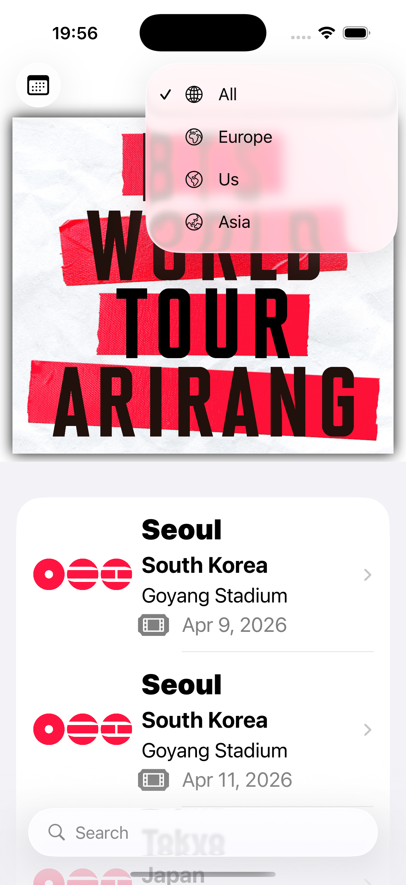
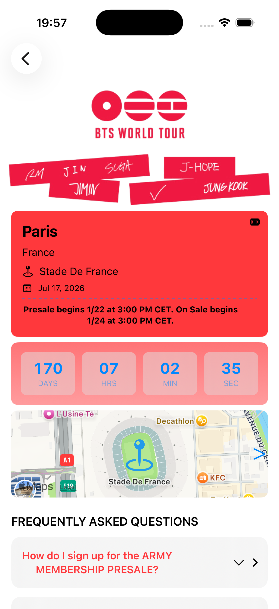
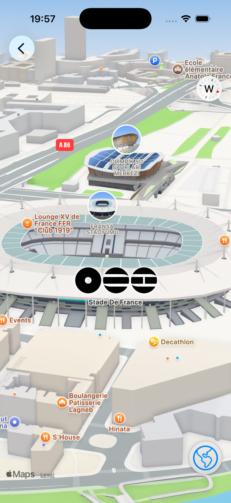
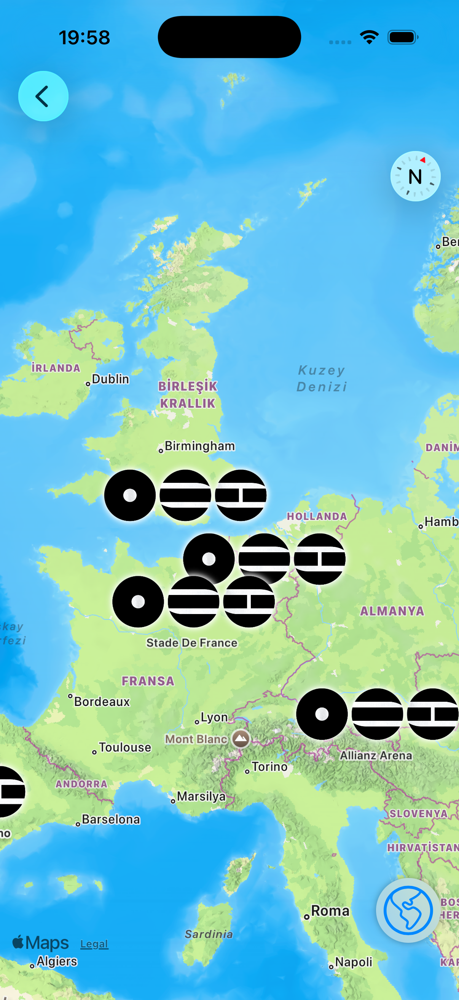

# BTS World Tour – Arirang

**BTS World Tour – Arirang** is an iOS application that presents global concert tour information through a clean, map-driven, and time-aware user interface.

The project is intentionally designed as a read-only experience, focusing on event discovery, location context, and clarity of information rather than user accounts or backend complexity.

---

## Overview

Fans often rely on multiple platforms to track concert dates, ticket sale times, and venue locations. This fragmentation leads to confusion, missed presales, and poor event awareness.

This application consolidates essential tour information into a single, structured interface, emphasizing discoverability, visual hierarchy, and time-sensitive data presentation.

---
## Screenshots
## Screenshots

  
  

  
  
  

---

## Key Features

### Tour Listing
    -  Displays all tour stops in a unified list
    - Supports multiple events per city
    -  Clear, scannable event cards

### Region Filtering
    - Filter concerts by geographic region:
     * All
     * Asia
     * Europe
     * United States

### Event Details
    Each event detail screen includes:
     - City and country
     - Venue name
     - Event date
     - Presale and general sale schedule
     - Real-time countdown timer
     - Map
     - FAQ Section

### Map Integration
    -  Interactive venue locations using MapKit
    -  Venue-level and regional map views
    -  3D map support for stadium exploration

### External Ticketing Access
    -  Direct redirection to official ticketing platforms
    -  No in-app purchases or third-party SDKs

### Informational FAQ
    - Presale eligibility explanation
    - Account matching guidance (Weverse & Ticketmaster)

---

## Technical Scope
      Platform: iOS
      Language: Swift
      UI Framework: SwiftUI
      Maps: Apple Maps / MapKit
      Architecture: Stateless, read-only UI
      Backend: None
      Authentication: None
      Data Persistence: None

---

## Design Decisions
    - Read-only architecture
      Reduces state complexity and allows the UI to remain predictable and easy to reason about.
    - No user accounts or backend services
      Keeps the focus on navigation, layout composition, and information hierarchy.
    - Official platform redirection
      Ensures ticket purchases remain within authorized and trusted ecosystems.

---

## Legal Disclaimer

This project is not affiliated with HYBE or BTS.

All artist names, trademarks, images, and event information are the property of their respective owners.
The application is created solely for educational and portfolio demonstration purposes.

---

## Author

Deniz Alp
iOS Developer  

This project was developed as a personal portfolio project.

Developed as an iOS portfolio project focused on:
    - SwiftUI-based UI architecture
    - Map-driven interfaces
    - Event-oriented user experiences
